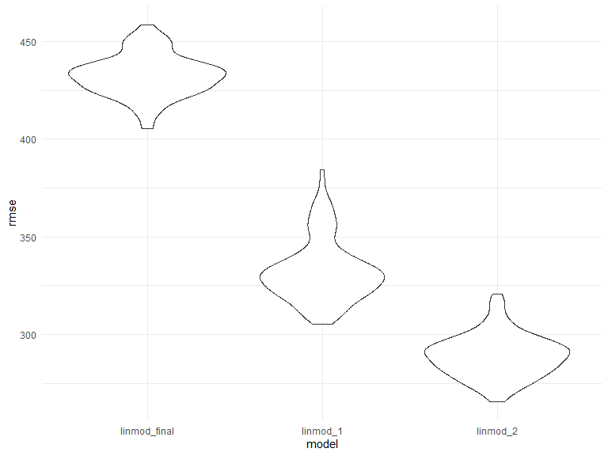

p8105\_hw6\_cs3779
================
CJ Snyder
11/19/2019

# **Problem 1**

## **Data Tidying**

``` r
bw_df = 
  read_csv("./data/birthweight.csv",
           col_types = "fdddddfdfdddfddddddd") %>% 
  janitor::clean_names() %>% 
  mutate(
    babysex = factor(babysex, levels=c(1,2), labels=c("male", "female")),
    frace = factor(frace, levels=c(1,2,3,4,8,9), labels = c("white", "black", "asian", "puerto rican", "other", "unknown")),
    malform = factor(malform, levels=c(0,1), labels=c("absent", "present")),
    mrace = factor(mrace, levels=c(1,2,3,4,8), labels = c("white", "black", "asian", "puerto rican", "other")),
    ppbmi = round(ppbmi, digits = 2),
    delbmi = round(703 * delwt / (mheight)^2, digits = 2)
  )

colSums(is.na(bw_df))
```

    ##  babysex    bhead  blength      bwt    delwt  fincome    frace  gaweeks 
    ##        0        0        0        0        0        0        0        0 
    ##  malform menarche  mheight   momage    mrace   parity  pnumlbw  pnumsga 
    ##        0        0        0        0        0        0        0        0 
    ##    ppbmi     ppwt   smoken   wtgain   delbmi 
    ##        0        0        0        0        0

Notes: No missing values for any of the
columns.

## **My Model Building**

``` r
linearmod = lm(bwt ~ babysex + delbmi + gaweeks + fincome + momage + ppbmi + smoken, data = bw_df)

linearmod %>% 
  broom::tidy() %>% 
  kable(digits = 3)
```

| term          | estimate | std.error | statistic | p.value |
| :------------ | -------: | --------: | --------: | ------: |
| (Intercept)   |    2.725 |    98.745 |     0.028 |   0.978 |
| babysexfemale | \-87.665 |    13.574 |   \-6.458 |   0.000 |
| delbmi        |   48.347 |     3.602 |    13.424 |   0.000 |
| gaweeks       |   60.093 |     2.195 |    27.375 |   0.000 |
| fincome       |    2.085 |     0.277 |     7.524 |   0.000 |
| momage        |    9.980 |     1.873 |     5.328 |   0.000 |
| ppbmi         | \-32.703 |     4.019 |   \-8.136 |   0.000 |
| smoken        |  \-7.562 |     0.919 |   \-8.229 |   0.000 |

``` r
linearmod_frace = lm(bwt ~ babysex + delbmi + gaweeks + fincome + momage + ppbmi + smoken + frace, data = bw_df)

linearmod_mrace = lm(bwt ~ babysex + delbmi + gaweeks + fincome + momage + ppbmi + smoken + mrace, data = bw_df)

anova(linearmod, linearmod_frace) %>% 
  broom::tidy()
```

    ## # A tibble: 2 x 6
    ##   res.df        rss    df     sumsq statistic   p.value
    ##    <dbl>      <dbl> <dbl>     <dbl>     <dbl>     <dbl>
    ## 1   4334 862426636.    NA       NA       NA   NA       
    ## 2   4330 805090932.     4 57335703.      77.1  3.00e-63

``` r
anova(linearmod, linearmod_mrace) %>% 
  broom::tidy()
```

    ## # A tibble: 2 x 6
    ##   res.df        rss    df     sumsq statistic   p.value
    ##    <dbl>      <dbl> <dbl>     <dbl>     <dbl>     <dbl>
    ## 1   4334 862426636.    NA       NA        NA  NA       
    ## 2   4331 803829565.     3 58597071.      105.  9.20e-66

``` r
linearmod_frace %>% 
  broom::tidy() %>% 
  kable(digits = 3)
```

| term              |  estimate | std.error | statistic | p.value |
| :---------------- | --------: | --------: | --------: | ------: |
| (Intercept)       |   509.652 |    99.727 |     5.110 |   0.000 |
| babysexfemale     |  \-85.521 |    13.129 |   \-6.514 |   0.000 |
| delbmi            |    48.083 |     3.482 |    13.809 |   0.000 |
| gaweeks           |    54.831 |     2.143 |    25.584 |   0.000 |
| fincome           |     0.552 |     0.282 |     1.957 |   0.050 |
| momage            |     2.243 |     1.884 |     1.191 |   0.234 |
| ppbmi             |  \-28.933 |     3.898 |   \-7.423 |   0.000 |
| smoken            |  \-11.309 |     0.915 |  \-12.359 |   0.000 |
| fraceblack        | \-278.672 |    15.914 |  \-17.511 |   0.000 |
| fraceasian        | \-125.130 |    65.100 |   \-1.922 |   0.055 |
| fracepuerto rican | \-188.451 |    29.734 |   \-6.338 |   0.000 |
| fraceother        |  \-77.778 |   115.817 |   \-0.672 |   0.502 |

``` r
linearmod_final = lm(bwt ~ babysex + delbmi + gaweeks + ppbmi + smoken + frace, data = bw_df)

linearmod_final %>% 
  broom::tidy() %>% 
  mutate(term = str_replace(term, "^frace", "Father's Race: ")) %>% 
  kable(digits = 3)
```

| term                        |  estimate | std.error | statistic | p.value |
| :-------------------------- | --------: | --------: | --------: | ------: |
| (Intercept)                 |   571.642 |    94.719 |     6.035 |   0.000 |
| babysexfemale               |  \-86.456 |    13.129 |   \-6.585 |   0.000 |
| delbmi                      |    47.309 |     3.461 |    13.667 |   0.000 |
| gaweeks                     |    55.185 |     2.139 |    25.803 |   0.000 |
| ppbmi                       |  \-27.874 |     3.851 |   \-7.238 |   0.000 |
| smoken                      |  \-11.358 |     0.915 |  \-12.409 |   0.000 |
| Father’s Race: black        | \-296.390 |    14.324 |  \-20.691 |   0.000 |
| Father’s Race: asian        | \-122.841 |    64.603 |   \-1.901 |   0.057 |
| Father’s Race: puerto rican | \-202.171 |    29.254 |   \-6.911 |   0.000 |
| Father’s Race: other        |  \-93.682 |   115.707 |   \-0.810 |   0.418 |

Notes: I started with covariates that wouldn’t be too colinear with
birthweight like birth length or head circumfrance (i.e. where a higher
value in one automatically determines a higher value in the other
without a clear causal direction). I then went through each variable
adding it to the model to test if that variable and the other variables
were/remained significant. If so, I kept them in the model. I conducted
partial F-tests to determine if categorical variables were significant.
*frace* was significant compared to *mrace*, but after including it in
the model, *momage* and *fincome* became insignificant, so I removed
them from the final model. I tried to be as parsimonious as well by
including BMIs instead of both height and weight (pre-pregnancy and
delivery).

## **My Model Diagnostics**

``` r
resid = modelr::add_residuals(bw_df, linearmod_final) %>% 
  select(resid)
pred = modelr::add_predictions(bw_df, linearmod_final) %>% 
  select(pred)

resid_pred = 
  bind_cols(resid, pred) %>% 
  ggplot(aes(x=resid, y=pred)) + geom_point()

resid_pred_vio = 
  bind_cols(resid, pred) %>% 
  ggplot(aes(x=resid, y=pred)) + geom_violin()

resid_pred
```


``` r
resid_pred_vio
```


## **Provided Model Building**

``` r
linmod_1 = lm(bwt ~ blength + gaweeks, data = bw_df)

linmod_1 %>% 
  broom::tidy() %>% 
  kable(digits = 3)
```

| term        |   estimate | std.error | statistic | p.value |
| :---------- | ---------: | --------: | --------: | ------: |
| (Intercept) | \-4347.667 |    97.958 |  \-44.383 |       0 |
| blength     |    128.556 |     1.990 |    64.604 |       0 |
| gaweeks     |     27.047 |     1.718 |    15.744 |       0 |

``` r
linmod_2 = lm(bwt ~ babysex + blength + bhead + babysex*blength + babysex*bhead + blength*bhead + babysex*blength*bhead, data = bw_df)

linmod_2 %>% 
  broom::tidy() %>% 
  kable(digist = 3)
```

| term                        |       estimate |    std.error |   statistic |   p.value |
| :-------------------------- | -------------: | -----------: | ----------: | --------: |
| (Intercept)                 | \-7176.8170221 | 1264.8397394 | \-5.6740920 | 0.0000000 |
| babysexfemale               |   6374.8683508 | 1677.7669213 |   3.7996150 | 0.0001469 |
| blength                     |    102.1269235 |   26.2118095 |   3.8962180 | 0.0000992 |
| bhead                       |    181.7956350 |   38.0542051 |   4.7772811 | 0.0000018 |
| babysexfemale:blength       |  \-123.7728875 |   35.1185360 | \-3.5244319 | 0.0004288 |
| babysexfemale:bhead         |  \-198.3931810 |   51.0916850 | \-3.8830816 | 0.0001047 |
| blength:bhead               |    \-0.5536096 |    0.7802092 | \-0.7095656 | 0.4780117 |
| babysexfemale:blength:bhead |      3.8780531 |    1.0566296 |   3.6702106 | 0.0002453 |

## **Cross-Validation between My and Provided Models**

``` r
cv_df = 
  crossv_mc(bw_df, 100)

cv_df =  
  cv_df %>% 
  mutate(
    train = map(train, as_tibble),
    test = map(test, as_tibble)
  )

cv_df = 
  cv_df %>% 
  mutate(
    linearmod_final = map(train, ~lm(bwt ~ babysex + delbmi + gaweeks + ppbmi + smoken + frace, data = .x)),
    linmod_1 = map(train, ~lm(bwt ~ blength + gaweeks, data = .x)),
    linmod_2 = map(train, ~lm(bwt ~ babysex + blength + bhead + babysex*blength + babysex*bhead + blength*bhead + babysex*blength*bhead, data = .x))
  ) %>% 
  mutate(
    rmse_linmod_final = map2_dbl(linearmod_final, test, ~rmse(model = .x, data = .y)),
    rmse_linmod_1 = map2_dbl(linmod_1, test, ~rmse(model = .x, data = .y)),
    rmse_linmod_2 = map2_dbl(linmod_2, test, ~rmse(model = .x, data = .y))
  )
```

### **Comparing My Model to 1st Provided Model**

``` r
cv_df %>% 
  select(starts_with("rmse")) %>% 
  pivot_longer(
    everything(),
    names_to = "model",
    values_to = "rmse",
    names_prefix = "rmse_"
    ) %>% 
  mutate(model = fct_inorder(model)) %>% 
  ggplot(aes(x=model, y=rmse)) + geom_violin()
```



Note: Based on the rmse values, it would seem that the provided models
(estimating birth weight by baby length and gestational weeks, and
estimating birth weight by baby length, gestational weeks, head
circumfrance, sex, and all of their interactions) are better than the
built model since they both have lower rmse values than the built model.

## **Problem 2**

### **Creating Boot Strap Samples**

``` r
boot_sample = function(x) {
  sample_frac(x, replace = TRUE)
}

bootsamp_df = 
  tibble(
    strap_number = 1:5000,
    strap_sample = rerun(5000, boot_sample(weather_df))
  )

bootsamp_results_betas = 
  bootsamp_df %>% 
  mutate(
    models = map(strap_sample, ~lm(tmax ~ tmin, data = .x)),
    results = map(models, broom::tidy) 
  ) %>% 
  select(-models, -strap_sample) %>% 
  unnest()
```

### **Analyzing Betas**

``` r
bootsamp_betas_int = 
  bootsamp_results_betas %>% 
  select(strap_number, term, estimate) %>% 
  filter(term=="(Intercept)")

bootsamp_betas_x =
  bootsamp_results_betas %>% 
  select(strap_number, term, estimate) %>% 
  filter(term=="tmin")

bootsamp_betas = 
  inner_join(bootsamp_betas_int, bootsamp_betas_x, by="strap_number") %>% 
  mutate(
    logbetas = log(estimate.x*estimate.y)
  )
```

### **Analyzing r-squares**

``` r
bootsamp_results_rsq = 
  bootsamp_df %>% 
  mutate(
    models = map(strap_sample, ~lm(tmax ~ tmin, data = .x)),
    results = map(models, broom::glance) 
  ) %>% 
  select(-models, -strap_sample) %>% 
  unnest() %>% 
  select(strap_number, r.squared)

bootsamp_final = 
  inner_join(bootsamp_betas, bootsamp_results_rsq, by="strap_number") %>% 
  select(strap_number, logbetas, r.squared)

ggplot(bootsamp_final, aes(x=logbetas, y=r.squared)) + geom_point()
```


Note: From looking at the distribution of R-squared values compared to
the Log(Beta\_0 \* Beta\_1) value of each bootstrapped sample, it seems
that as the value of logbetas grew, the r-square value drops (i.e. a
negative correlation between the two values).

### **95% Confidence Intervals for Betas and R-squares**

``` r
kable(quantile(bootsamp_final$logbetas, c(0.025, 0.975)))
```

|       |        x |
| ----- | -------: |
| 2.5%  | 1.964949 |
| 97.5% | 2.058887 |

``` r
kable(quantile(bootsamp_final$r.squared, c(0.025, 0.975)))
```

|       |         x |
| ----- | --------: |
| 2.5%  | 0.8936684 |
| 97.5% | 0.9271060 |
